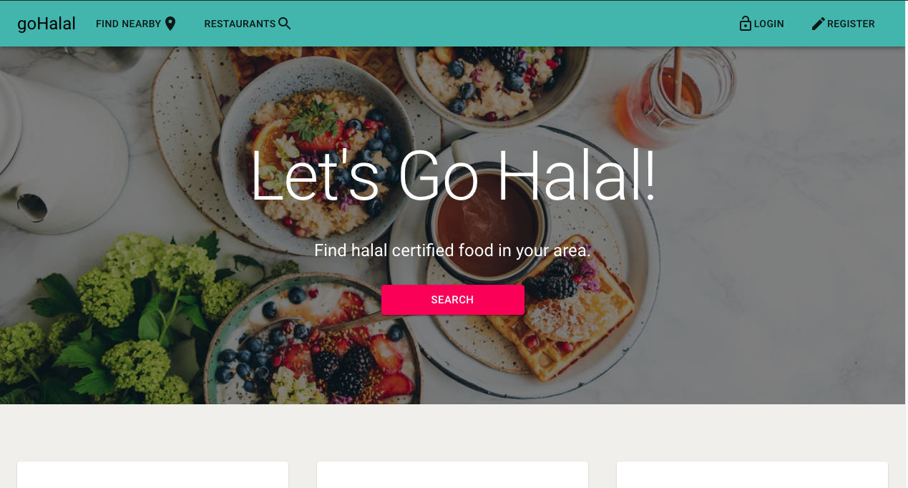
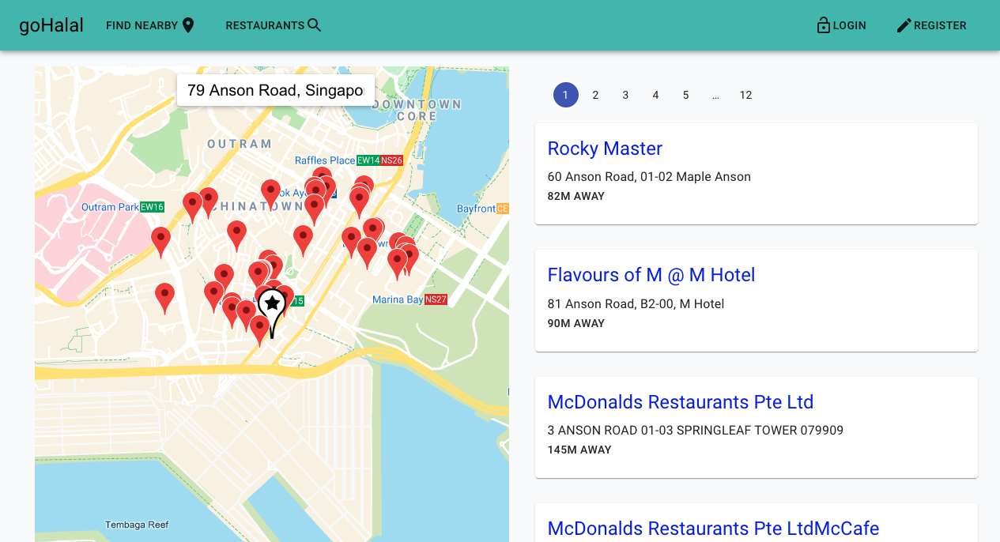
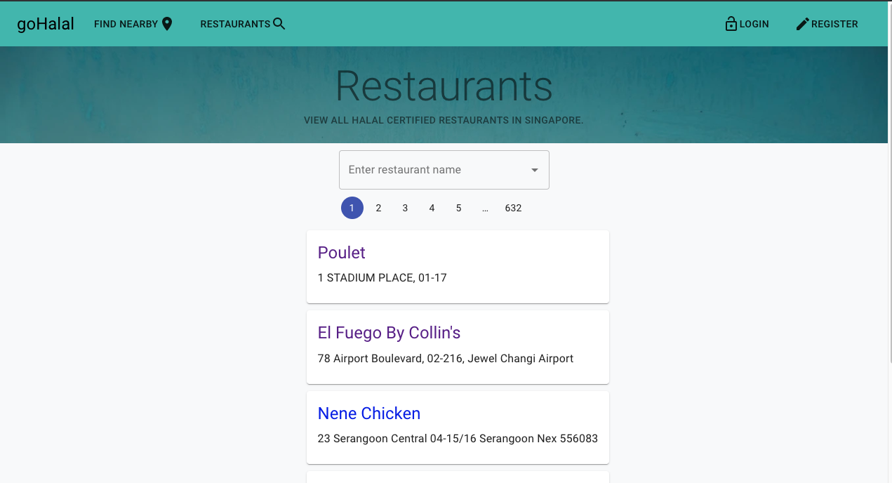
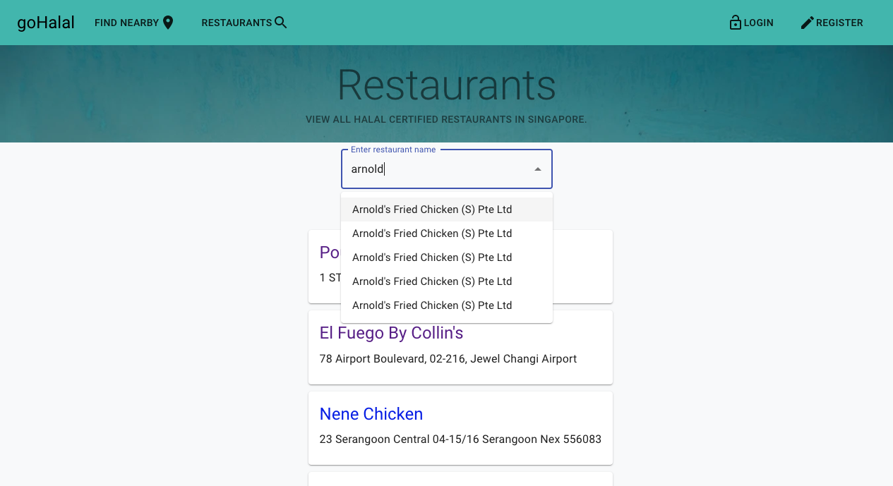
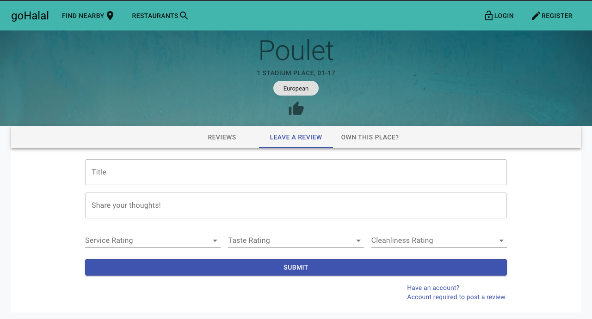
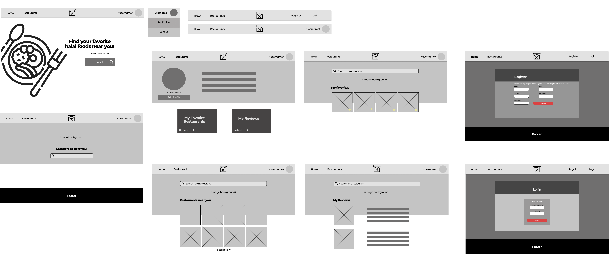

## Introduction
App is hosted here - https://gohalalsg.herokuapp.com/

Splash Screen

Map Search 

All Restaurants

Search By Restaurant Name

Restaurant Review

#### React App Objectives
This is a collaborative app created by me, Muhammad Saiful & Muhammad Hafiz.

A first world problem that we always face is finding a halal restaurant to eat at whenever we're somewhere unfamilliar. Having realised that Google searches dont do much justice, giving innacurate or outdated information, and there are no resources available to show us what are the nearest halal restaurants nearby, we decided to create this app to ease the search and thought process of finding a suitable place to eat.

Users are able to see where the restaurants are by the markers on the map, and see how far it is from their location. Users are also able to leave reviews on the restaurants.

## Breakdown

#### Technologies used:
1. ReactJS
2. Django
3. Material UI
4. React Google Maps API
5. PostgreSQL

#### Further Possible Improvements
- Fine tuning user roles
- Addition of adding restaurants to favourites
- Additional tabs for restaurant reservations, promotions

#### Wireframes

